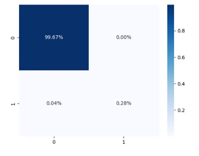
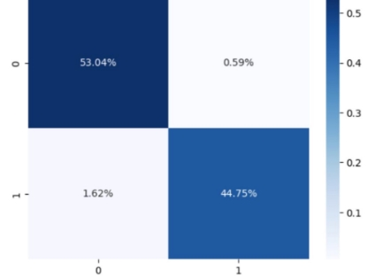
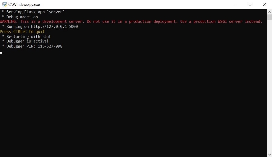

**Technical Specification**

**Name(s):**Jordan Ukawoko, Luke Whelan **Module Code:** CA326

**Project Title:** Atlas

**Supervisor**: Paul Clarke

1

**Key Content** Introduction

1. **Goals**

Credit / Debit Cards are now the main method of purchasing goods and services, both in-store and online. However, sometimes we don’t know if our card has been used for purchases without us knowing, especially as malicious actors devise new ways to circumvent the bank’s authentication system. For example, committing card not present (CNP) fraud, that is, making transactions without physical possession of the credit cards via phone or email, or by taking over the cardholder’s account via phishing emails or deceptive texts.

The main goal of Atlas is to be able to scan a database of transactions and flag transactions that are deemed suspicious or vastly different to the other transactions as fraudulent.

The goal is to develop Atlas to detect such unauthorised activity which has made it past the bank’s first line of defence; its authentication system. Atlas is designed to be used by the bank, or any other financial provider which offers current accounts to its customers. When a fraudulent payment occurs, the cardholder disputes the charge and the debit is usually cancelled, meaning either the cardholder’s bank or the merchants absorb the loss. These payments therefore represent a significant risk to the merchant and the issuing bank, however by using Atlas to monitor spending on the bank’s

customer accounts, the bank can spot fraudulent activities quickly which can help the bank and merchants recover the loss.

Fraudulent transactions can also result in negative impacts on cardholders, such as damage to their credit scores or unauthorised charges on their accounts. Atlas helps to identify these fraudulent transactions to protect the cardholder. By maintaining trust, Atlas will help financial institutions to generate confidence and maintain trust with their customers.

2. **Research**

In order to create this application to perform to the best of its ability, many months of intensive research was undertaken. The first part of the research was to understand what credit card fraud was and why it is a problem. As mentioned above, we found that credit card fraud is a significant issue because it can result in financial loss for both the cardholder and the card issuer and in general it can lead to long lasting effects on one’s financial wellbeing.

We were interested in creating a credit card fraud detection application because we wanted to apply our skills to a real-world problem such as fraud. Our main motivation was to create a fraud detection app to help financial institutions from emotional impacts of credit card fraud.

One area we were particularly interested in was the area of machine learning and artificial intelligence. We found that these areas are innovating everyday and we were excited about the prospect of using cutting-edge technologies such as artificial intelligence and machine learning to detect fraud in new and innovative ways.

We had no prior knowledge of machine learning methods and data-mining techniques or frontend techniques such as using Electron to create an intensive graphical user interface. It was interesting learning these methods during our software engineering journey.

3. **Overview**

Atlas implements many different technologies that all come together to create the application.

Atlas uses machine learning algorithms, in particular XGBoost which is especially well-suited for fraud detection because of its ability to handle imbalanced datasets, which is a common issue in credit card fraud detection.

The systems implemented in the Atlas application includes the use of Flask to handle the web server for the application, Electron which is used as the framework for our application and the graphical user interface for our application. Electron plays a role in being our main Frontend.

The backend which consists of the machine learning algorithm is written in Python with analysis done in the notebooks.

The frontend of Atlas mostly consists of Javascript and HTML for creating the different pages. We created an SQL database to host all the different customers with their transactions. Atlas calls from this database and scans the database with the use of Machine Learning for any possible fraudulent transactions

4. **About the Dataset**

The dataset we are using is from kaggle[. A datas](https://www.kaggle.com/datasets/mlg-ulb/creditcardfraud)et was vital for the creation of Atlas. A dataset is needed in credit card fraud detection because it provides the necessary information to train a machine learning model to recognize patterns and detect fraudulent transactions.

By using this dataset to train a machine learning model, our models can learn to identify patterns and characteristics of fraudulent transactions, such as unusual transaction amounts, unusual transaction locations, or transactions that occur outside of a cardholder's normal spending patterns. The model we are using (XGBoost),  can then use this information to detect potentially fraudulent transactions in real-time as they occur.

- The dataset Contains transactions made by credit cards in September 2013 by European cardholders. The dataset presents transactions that occurred in two days, in which in the dataset we have 492 frauds out of 284,807 transactions.
- Dataset set is unbalanced, the positive class (non-frauds) accounts for 0.172% of all transactions
- Due to confidentiality issues there is no provision of the original features and more background information of the data.
- Features V1,V2…V28 are the principal components obtained with PCA. The only features not transformed are time and amount.
- Time contains the seconds elapsed between each transaction and the first transaction in the dataset.
- The feature 'Amount' is the transaction Amount, this feature can be used for example-dependent cost-sensitive learning. Feature 'Class' is the response variable and it takes value 1 in case of fraud and 0 otherwise.

- There is a class imbalance issue which is why we measured the accuracy using the Area Under the Precision-Recall Curve (AUPRC)
5. **Glossary**

**Machine Learning -** Machine learning is a subfield of artificial intelligence (AI) that involves the use of algorithms and statistical models to enable computer systems to learn from data, identify patterns and make predictions or decisions without being explicitly programmed.

**Flask -** Flask is a web framework that is often used in conjunction with machine learning to develop web applications that incorporate machine learning models.

**Electron -** Electron is a framework that allows developers to create desktop applications using web technologies such as HTML, CSS, and JavaScript.

**SQL Database -** SQL (Structured Query Language) is a programming language that is used to manage and manipulate relational databases. An SQL database is a type of database that uses SQL to interact with the data stored within it.

**Jupyter Notebook -** A Jupyter Notebook is an open-source web application that allows you to create and share documents that contain live code, equations, visualisations, and narrative text.

**Pickle** - Is the process whereby a Python object hierarchy is converted into a byte stream, and “unpickling” is the inverse operation, whereby a byte stream (from a binary file or bytes-like object) is converted back into an object hierarchy.

**Data Preprocessing  -** Data preprocessing is a crucial step in machine learning that involves transforming raw data into a format that can be easily used by machine learning algorithms. The goal of data preprocessing is to clean, transform, and prepare the data so that it is consistent, accurate, and relevant for training a machine learning model.

**Principal Component Analysis -** Principal Component Analysis (PCA) is a commonly used technique in machine learning for dimensionality reduction, data compression, and feature extraction. It is used to transform a dataset into a new coordinate system, such that the new variables

**Features  -** In machine learning, features refer to the individual measurable properties or characteristics of a data point or observation. They are the variables or attributes that are used to describe and quantify the input data that is fed into a machine learning algorithm.

**MinMax Scaling -** A  data preprocessing technique used in machine learning to scale and transform numerical data. It is used to rescale the values of a feature to be between 0 and 1, which is a common range for many machine learning algorithms.

**Noise -** noise refers to the random variation or error present in a dataset that can obscure or distort the underlying patterns or relationships that the machine learning algorithm is trying to learn. Noise is unwanted information in a dataset

**Outliers -** an outlier is a data point that is significantly different from other data points in the dataset. Outliers can be the result of measurement or recording errors, data processing errors, or they may be legitimate data points that are far outside the normal range of values for the variable of interest

**Training & Testing -** The training set is used to teach the machine learning algorithm how to make predictions. The algorithm is presented with a set of input data and corresponding output values The testing set is used to evaluate the performance of the trained model. The algorithm is presented with input data from the testing set

**Downsampling -** downsampling refers to the process of reducing the number of samples in a dataset by selecting a subset of the original data

**Upsampling -** Upsampling in machine learning is a technique used to increase the resolution or size of an image or signal. It involves increasing the number of samples in a dataset or increasing the spatial dimensions of an input image, often with the aim of improving the performance of a machine learning model.

**Class Imbalance -** Class imbalance in machine learning refers to a situation where the number of observations in different classes of a

dataset is not equal. This means that one class may have significantly more or fewer examples than other classes.

**Smote** - used to address class imbalance in a dataset. It is a type of oversampling technique that generates synthetic samples for the minority class by interpolating new examples in the feature space

**Area Under Precision Recall Curve -** AUPRC stands for "Area Under the Precision-Recall Curve," and it is a performance metric used in machine learning to evaluate the performance of a binary classification mo

**Continuous Variables -** Continuous variables are numeric variables that have an infinite number of values between any two values. A continuous variable can be numeric or date/time

**F1 Score -** Combines the precision and recall scores of a model. The accuracy metric computes how many times a model made a correct prediction across the entire dataset

**Accuracy -** Accuracy measures the overall correctness of the model's predictions. It is defined as the ratio of correctly predicted instances to the total number of instances.

**Recall -** Recall (also known as sensitivity or true positive rate) measures the fraction of actual positive instances that the model correctly identified. It is defined as the ratio of true positive instances to the total number of actual positive instances.

**Precision -** Precision measures the fraction of instances that the model classified as positive that are actually positive. It is defined as the ratio of true positive instances to the total number of instances that the model classified as positive.

**Specitivity -** Specificity (also known as true negative rate) measures the fraction of actual negative instances that the model correctly identified. It is defined as the ratio of true negative instances to the total number of actual negative instances.

**Sensitivity -** Sensitivity (also known as recall or true positive rate) measures the fraction of actual positive instances that the model correctly identified. It is defined as the ratio of true positive instances to the total number of actual positive instances.

**Receiver Operating Characteristic -** An ROC curve (receiver operating characteristic curve) is a graph showing the performance of a classification model at all classification thresholds. This curve plots two parameters: True Positive Rate. False Positive Rate.

**Cross Validation -** A technique for evaluating ML models by training several ML models on subsets of the available input data and evaluating them on the complementary subset of the data

**True Positives -** True positives are the cases where the model predicts a positive class, and the actual class is also positive. In other words, true positives are the correct predictions of the positive class.

**False Positives -** False positives are the cases where the model predicts a positive class, but the actual class is negative. In other words, false positives are incorrect predictions of the positive class.

**True Negatives -** True negatives are the cases where the model predicts a negative class, and the actual class is also negative. In other words, true negatives are the correct predictions of the negative class

**False Negatives -** False negatives are the cases where the model predicts a negative class, but the actual class is positive. In other words, false negatives are incorrect predictions of the negative class.

**Confusion Matrix -** A confusion matrix presents a table layout of the different outcomes of the prediction and results of a classification problem and helps visualise its outcomes.

**Classification -** Classification is a supervised learning technique used to assign input data points to one of several predefined categories (or classes) based on a set of labelled training data.

**Decision Trees -** Decision trees are a hierarchical structure of nodes, where each node represents a decision based on a feature or attribute value, and each edge represents the outcome of the decision.

**K-Nearest Neighbours -** KNN is a simple algorithm that assigns a test point to the class of its nearest neighbours in the training set. The value of k represents the number of neighbours to consider.

**Logistic Regression -** Logistic Regression is a statistical algorithm that models the relationship between a binary dependent variable and one or more independent variables using a logistic function.

**Random Forest -** Random Forest is an ensemble learning algorithm that combines multiple decision trees to improve the accuracy and reduce overfitting. In Random Forest, each tree is built using a random subset of the features and a random subset of the training data.

**XGBoost -** XGBoost is an optimised implementation of gradient boosting, a machine learning technique that combines multiple weak models to create a strong model. XGBoost is highly scalable, can handle missing values and different types of features, and can be used for both classification and regression problems.

**Supervised Machine Learning -** The  use of labelled datasets to train algorithms that to classify data or predict outcomes accurately.

**Unsupervised Machine Learning -** Uses machine learning algorithms to analyse and cluster unlabeled datasets. These algorithms discover hidden patterns or data groupings without the need for human intervention.

User Interface Design

6. **Framework**

Atlas’s machine learning algorithms are written in Python. In fact, the entirety of the backend communicates through Python. Thus, our initial idea was to use a Python-based Graphical User Interface (GUI) framework. However, after experimenting with two of the most popular frameworks such as Tkinter and Kivy, we quickly realised that our design and styling options would be extremely limited. We also realised that these frameworks would have been unable to process and dynamically display information pulled from our machine learning algorithms and SQL databases.

It became clear that only the powerhouse web development languages would meet all of our functional needs:

- Independent ‘pages’, implemented as .HTML files. E.g. analysis-results.html, to display the results of our analysis.
- Powerful styling abilities through CSS
- Ability to process button on-click events through event listeners in Javascript
- Ability to serialise Python data returned by our Flask server, by converting the data to JSON format through Javascript.
- Ability to populate said JSON data in our HTML pages through Javascript.

However, our goal was for Atlas to be a native desktop application, and not a ‘web-app’. After some research, we discovered **Electron** would allow us to

utilise web languages and frameworks in a native application. Applications such as Visual Studio Code, Discord, Slack and previously WhatsApp Desktop have all been created using the Electron framework, making it a no-brainer for our front-end framework.

System Architecture

7. **System Architecture Diagram**

Atlas’s system architecture diagram can be seen below. As we can see, the system functions as follows:

- The bank staff instruct the software to start a new analysis.
- The interface sends a call to the flask server.
- The flask server pulls data (i.e. rows of transactions) from the database, and feeds this data to the machine learning model.
- The machine learning model returns the results to flask.
- Flask sends the results back to the interface through the Javascript Fetch API.

8. **Directory Structure **

Our root directory contains the following subdirectories: 

- dist - contains distributions for Windows and MacOS 
- docs - contains our documentation 
- res - contains some resources such as the README file 
- src  - contains the source files for Backend and Frontend, as well as relevant testing files. 

Note that the user is interested only in: 

- The .exe or .dmg file, depending on their platform 
- The server.py file (they must navigate to the backend directory and start it from there). 

High Level Design

9. **State Chart Diagram**

This state chart diagram above for Atlas outlines the different states and transitions involved in the process of analysing credit card transactions for potential fraud.

The diagram begins with the "Dashboard" state, which provides the user with several options to start a new fraud analysis, request analytics, or view the about page. If the user chooses to start a new analysis, the app retrieves transaction details from a database and proceeds to analyse them for patterns and indicators of fraud.

If fraud is detected, the app takes appropriate action, which displays all the fraudulent transactions on the screen.  Once the analysis is complete, the app returns to the Dashboard state.

If the user chooses to request analytics, the app generates analytics using an XGboost machine learning model and displays the results in the "Analytics Page". The user has the option to view the jupyter notebook or to view a more condensed version with the different sections (etc about the dataset, classification) user can then return to the Dashboard state.

10. **Sequence Diagram**

11. **Use Case Diagram**

12. **Main Actors**

- Financial Institution: This actor initiates requests for new analyses, loading of analysis data, and loading of customer and transaction information from the database. The financial institution also receives analysis results from the Atlas application.
- User: This actor interacts with the Atlas application to perform tasks

We also had the following components

- Database: This component stores customer and transaction information, as well as analysis results generated by the Admin component.
- Admin: This component stores the analysis model used by the Atlas application to detect fraud.
- Atlas: This component is the main application that provides fraud detection services to the Financial Institution and User actors.
13. **Main Use Cases**
- **Start New Analysis**
- New Analysis button to start analysis to search the database for possible fraud detection using the XGBoost Machine Learning algorithm
- Lists all the possible fraudulent transactions in the database after the search
- Search bar can be used to filter for different users

- **Load Analytics**
- Using HTML Pages and Javascript the user can view different types of data visualisation
- The ability to view the jupyter notebook for a more in depth and comprehensive knowledge of how the machine learning algorithm was trained and tested
- The ability to view observations found from the notebook
- Ability to view information about the dataset used
- Ability to view the data-processing process
- Ability to view the different types of machine learning models and how the best one was chosen
- Ability to view different training methods used (Smote vs Non-Smote)
- Ability to view some of the different terminology
- **Load About**
- General insight of the application
- **Main Actors**
- Financial Institutions
- Admin
- Database

Problems and Resolution

**Problem #1 - GUI Languages**

The first problem was deciding on an appropriate Graphical User Interface framework. Initially, we experimented with two of the most popular Python-based Graphical User Interface (GUI) frameworks; Tkinter and Kivy. However, both frameworks have a weak toolset in terms of styling, and provide little to no data processing support. We also realised that these frameworks would have been unable to process and dynamically display information pulled from our machine learning algorithms and SQL databases.

**Problem #1 - Solution**

It became clear that only the powerhouse web development languages would meet our design and processing needs. As a result, we decided to design our Graphical User Interface in HTML, CSS and Javascript.

**Problem #2 - GUI Framework**

However, our goal was for Atlas to be a native desktop application, and not a ‘web-app’. Our vision was for Atlas to be launchable directly from the desktop, and for it to be its own executable application.

**Problem #2 - Solution**

After some research, we discovered **Electron** would allow us to utilise web languages and frameworks in a native application. Applications such as Visual Studio Code, Discord, Slack and previously WhatsApp Desktop have all been created using the Electron framework, making it a no-brainer for our front-end framework. See https[://www.electronjs.org/](https://www.electronjs.org/)

**Problem #3 - Searchable Transaction Info**

As outlined in the dataset information section, all of the transactions in the dataset have undergone Principal Component Analysis and private information such as names, addresses and location information has been anonymised. As a result, each transaction does not have searchable information attached. I.e. nobody is going to remember some PCA component partition weight of a specific transaction! This was a problem as we wanted to search for transactions based on real-life information.

**Problem #3 - Solution**

The solution was to ***add*** first names, surnames and locations to each of the transactions. This was done by parsing text files containing names, addresses and locations, and adding these to the transactions in a new CSV file.

**Problem #4 - Transaction Info Storage**

During the early stages of development, we were using CSVs as our storage of data. I.e. we were continuously scraping the CSV for the information we wanted. This helped us to get Atlas off the ground, but we soon realised that reading and writing from and to a CSV is not an appropriate storage of information.

**Problem #4 - Solution**

As a result, it was decided to store the transactions contained in the CSV in an SQL database. This was done through the SQLite3 library in Python. The result was a clean, organised collection of transactions. Pulling specific transactions on-the-hop became effortless.

**Problem #5 - Communicating with ML Model**

Our interface was written in HTML, CSS and Javascript, but our Machine Learning models were written in Python. This left us with a problem; how do we pull information from the machine learning models, and process it with Javascript, and dynamically fill our HTML pages?

**Problem #5 - Solution**

The solution was to use Flask to run transactions against the trained model. With flask, we set up a route to handle the ‘analysis’. We iterate over our SQL database rows (i.e. our transactions), call our model’s predict function on the current transaction’s PCA values, and store the 

result in our ‘results’ dictionary. This dictionary is then returned by the route to its caller.

**Problem #6 - Inaccurate analysis results**

Upon initially scanning the database, our results were completely inaccurate, and at first, it did not seem obvious why. Almost half of the transactions scanned were being flagged as fraudulent.

**Problem #6 - Solution**

After carefully reviewing our code, we realised the problem was our ‘amount’ figure. During the training of the model, the amount figure was scaled downwards, to bring it in line with the size of the principal component analysis partitions. However, when sending our transactions to our trained model from flask, ***we were sending the unscaled amount figure*** for each transaction. After downscaling the amount by the same proportion as used in the training of the model, the analysis returned the correct results.

**Problem #7 - Class Imbalance Issues (Machine Learning)**

Class imbalance occurred in this dataset because in general, fraudulent transactions are quite rare and infrequent compared to legit transactions. This means that the number of fraudulent transactions in a dataset is usually much smaller than the number of legitimate transactions. As a result, the dataset is imbalanced, with one class

(non-fraud transactions) dominating the other class (fraudulent transactions).

The class imbalance issue in credit card fraud detection can cause problems for machine learning algorithms, as they can become biassed towards the majority class and have difficulty detecting the minority class. This can result in a high false negative rate, where fraudulent transactions are not detected, and a low precision rate, where legitimate transactions are incorrectly identified as fraudulent.

**Problem #7 - Solution.**

AUPRC & ROC Curve was used for the class imbalance issues because it provides a more accurate and informative evaluation of the performance of a machine learning model in classifying the minority class (in this case, the fraudulent transactions) than other evaluation metrics such as accuracy.

AUPRC is strong because it focuses on the precision and recall of the minority class (fraud), which are more relevant metrics in the context of fraud detection. AUPRC was important because it is a better and more appropriate evaluation for credit card fraud because the frauds which are the minority class are very rare and need to be accurately detected.

**Problem #8 - Scaling Issues (Machine Learning)**

We encountered scaling issues during the data preprocessing process of the machine learning aspect. 28 of the 31 features had been transformed with Principal Component Analysis, however 2 of the features “Amount” and

“Time” were not transformed with Principal Component Analysis and their original features were left untouched.

The transaction amount is an important feature used to detect fraudulent activities. However we ran into issues during analysis testing because the unscaled amount feature led to some transactions that should be classed as “fraud” as “non-fraud” and vice versa.

**Problem #8 - Solution**

Scaling the transaction amount helped to reduce the impact of the transaction amount on the overall fraud detection model and ensure that other features are given equal weight in the model. This fixed transactions that were being incorrectly classified.

**Functional Spec vs FInal Delivery**

The original goal of Atlas was to have the financial institution upload a CSV containing bank transactions, in which the machine learning algorithm will scan the transactions to see which transactions could possibly be “fraudulent”. Other features we had in mind was for the application to detect the location of the possible fraudulent transaction, the bank the transaction belonged to etc

However we quickly figured out that this would be very challenging to do without information from every bank account and that what we would be doing would be a kind of unsupervised machine learning. After careful consideration we came to the conclusion that to create a strong fraud detector app we would need a labelled dataset and would need to train and test the dataset to work with the model. The main end goal of Atlas did not

change. It is still a fraud detector app with data visualisation features, however it is working using a labelled dataset. We disposed of the upload CSV feature, because that would require us having information from real world banks (AIB, Ulster Bank etc), we also disposed of the automatic location feature as again, we do not have access to permissions such as getting a persons address.

Instead we created a database to store different customers with different addresses that we created. This was an interesting solution to the location issue.

Installation Guide

Installing Atlas is simple. Atlas is supported on Windows and MacOS.

Windows

***Before running the app, we must start the server.***

1. Download the repo found here. [Click ](https://gitlab.computing.dcu.ie/ukawokj2/2023-ca326-lwhelan-jukawoko)on the download zip file option
1. Navigate to the ‘src’ folder.

3. Navigate to the ‘Backend’ folder.

4. ‘Atlas’...

5. Double-click ‘server.py’ to run the server.

6. A terminal like below will open.

***The server has now been started. We can now go about launching Atlas.***

7. Navigate back to the root directory, and into the ‘dist’ folder.

8. Windows…

9. win-unpacked

10. Double-click Atlas.exe and Atlas will launch.

11. Note that this code is *unsigned,* and thus your antivirus may flag it as suspicious. Add atlas as an exception in your antivirus.

MacOS

12. Navigate back to the root directory, and into the ‘dist’ folder.

13. Mac…

14.Click on dist(mac) after opening the Mac Folder

\15. Double-click Atlas.dmg and Atlas will launch.

**Appendix**

Machine Learning Process

14. **Data Preprocessing**

Before we can use our dataset we must perform data pre-processing. Data-preprocessing is important for removing missing or inconsistent data resulting from human or computer error e.g duplicates or random data that makes no sense (noise). Data-preprocessing can help improve the accuracy and quality of our dataset and thus make it significantly more reliable and consistent.

We dropped the time feature because we found that it is a continuous variable that follows a linear order, and it does not provide much information about the transaction itself, such as the location, type of transaction, or the identity of the cardholder.

We used min max to normalise numerical data to a specific range. This is done to ensure that the data is on a common scale and can be more easily compared across different features, and to prevent features with larger scales from dominating those with smaller scales in some algorithms.

The above code snippet was used to generate summary statistics of the DataFrame, including count, mean, standard deviation, minimum, and maximum values for each numerical column in the DataFrame.

A DataFrame is a two-dimensional labelled data structure that consists of rows and columns, similar to a spreadsheet or a SQL table. It is a fundamental object in pandas, and is designed to handle tabular data. Df shape was used to tell us the amount of rows and columns in the dataset

We also decided to scale our variables in the dataset. This was done because it was done to standardise the range of values for each feature in the data, so that all features are on a similar scale. This is important because many machine learning algorithms are sensitive to the scale of the input features, and if the features are not on a similar scale, some features may dominate others, leading to biassed or incorrect predictions.

In particular we scaled the amount feature because the "amount" feature has a significantly different scale than the other features, as this could cause the model to overemphasise or underemphasize the "amount" feature relative to the other features. We scaled it so it was similar to the other features, again to prevent bias and incorrect predictions

We created a density and amount curve. The Density and amount distribution curve was useful for visualisation to help identify patterns and anomalies in the data.

By plotting the density and amount distribution curves of both the legitimate and fraudulent transactions, we can identify patterns or differences between the two that could indicate fraud. For example, fraudulent transactions may have a higher frequency of occurring at certain amounts or have a different distribution of amounts than legitimate transactions

Next, we checked for duplicates. Before removing any duplicate transactions found in the dataset we observed that we had a grand total of 284807 transactions. During the cleaning process we observed the changes and came to the conclusion that the dataset consisted of 283726 transactions after removing the duplicates. Removing the duplicates is important because it helps us to scale the dataset

By removing the duplicates from this dataset was also important because duplicated data can artificially inflate the size of the dataset, leading to overfitting and a decrease in the accuracy of the model.

We wanted our models to be as accurate as possible. We also felt that duplicates can lead to bias predictions. This can result in over-representation of certain classes, leading to biassed predictions. For example the models may be very biassed toward the non fraud class.

We created a box plot to investigate if there was any outliers within the dataset and our result was that the box plot showed there was quite a few outliers and thus we decided to drop all outliers that were outside the third quarter and the interquartile range and below the first quarter and the interquartile range.

We did this because by dropping outliers that are outside of these boundaries, we can remove extreme values that are likely to skew our analysis and misrepresent the true underlying distribution of the data. We felt removing outliers would help the model accuracy and reduce noise

We only dropped outliers in class 0 (positive, non-fraud). If we dropped outliers in class 1, the data will only contain 17 frauds out of 146000.

We took a new look at the box plot and observed the values were a lot lower. As we got a new q1 and q3 we can see that there is still some outliers within the dataset but these are assumed to be part of class 1 and since we deleted outliers from class zero as we had too many data-points, we removed the outliers and balanced the dataset. The new dataset only contained half of the original data points.

15. **Training & Testing Without Smote**

Before splitting and training our dataset we need to define dependent and independent variables. The dependent variable known as X and the independent value known as Y. The first part is we split the dataset into two subsets, with a portion for training. We split it by 80/20 → 80% for training and 20% for testing.

We trained the different models using the training data. This involved feeding the training data into the model, allowing the model to learn from this data.

We upsampled and downsampled for more accurate results. We upsampled the minority class and downsampled the majority class.

We upsampled and downsampled because of the class imbalance issue. We felt because the majority class is quite imbalanced it can lead to a bias in the model towards the majority class and a poor performance in predicting the minority class.

We upsampled by duplicating existing samples, we felt it would have helped the model to learn from more examples of the minority class and improve its ability to correctly predict it.

We downsampled by decreasing the number of samples in the majority class by randomly removing samples. This can help to balance the class distribution and prevent the model from being biassed towards the majority class.

We felt they may have been drawbacks…with this technique such as a risk of overfitting, which is why we applied a second sampling technique

16. **Training & Testing With Smote**

In this sampling strategy, the function SMOTE from im-blearn is being used. It creates synthetical data points for the minority class that reminds of already existing points. The data will be balanced, but the synthetical data points might be one to many.

In general smote was used as an oversampling method to balance the class distribution since the dataset was highly imbalanced. The goal of using smote as mentioned above is to generate synthetic samples of the minority class in order to balance the dataset and improve the distribution and performance of the model.

How smote was performed in our analysis was that it identified the minority class which was the fraud and calculated its class distribution. The class distribution was 0.32% For each sample in the minority class, SMOTE calculates the k-nearest neighbours based on the Euclidean distance between the sample and its neighbours.

For each sample in the minority class, SMOTE generates synthetic samples by randomly selecting one of its k-nearest neighbours and calculating the difference between the selected neighbour and the sample. The synthetic sample is generated by adding this difference to the sample.

The original samples and the synthetic samples are combined to create a new, balanced dataset.

Finally we trained the machine learning model on the balanced dataset

*However we felt that with smote it led to some unrealistic results, in a real world scenario we wouldn't have fraud and non fraud be equally as common so we decided to train the model using the first dataset which we only did slight upsampling and downsampling, however we decided to go ahead and use Smote as well as a compare and contrast and it was interesting comparing the accuracy, confusion matrix of the models etc between the smote dataset and the non smote dataset, in this notebook we are only running the first dataset since we cannot run both sampling methods at once, however there will be a final observations which show the difference between smote and non smote*

17. **Classification**

We decided for the second part of this analysis that we would focus on classification. We built different machine learning models one by one.These classifier models will be using the data we upsampled and downsampled. The five models we focused on were Decision Trees, Logistic Regression, Random Forest, XGBoost and K-Nearest Neighbours. We compared the five different machine learning classification models to each other and found the model with the strongest f1 score, accuracy, precision and recall.

We also got the confusion matrix for each model without Smote and with Smote. The confusion matrix is a table used to evaluate the performance of a classification model in machine learning. It shows the number of true positives, true negatives, false positives, and false negatives for a set of predictions made by the model..

In the context of credit card fraud, a confusion matrix was used to evaluate the performance of a fraud detection model. The model predicts whether a transaction is fraudulent or not, and the confusion matrix shows how well the model is able to distinguish between fraudulent and non-fraudulent transactions. Below we will see example of the confusion matrix performance without smote sampling method and with the smote sampling method

**Decision Trees**

- Credit card fraud detection often involves detecting complex, non-linear relationships between features. Decision trees can capture these relationships, which can make them more effective at identifying fraudulent transactions.
- Decision trees are highly interpretable, which means that fraud analysts can easily understand the rules used to make predictions. This can help in identifying the key features that are important in detecting fraudulent transactions.
- However Credit card fraud detection datasets are often imbalanced as seen with this one, with a large number of legitimate transactions and a

small number of fraudulent transactions. Decision trees can struggle to learn patterns in imbalanced datasets, which can lead to poor performance in detecting fraud.

**Confusion Matrix (without Smote - Top, with Smote - Bottom)**

||

**AUPRC-ROC Curve (without Smote - Top, With Smote - Bottom)**

|
| - | - |
||

**K Nearest Neighbours**

- KNN algorithm is based on the assumption that similar data points tend to belong to the same class. The algorithm works by assigning a new observation to a class based on the class of its k-nearest neighbours in the feature space.
- KNN is strong because KNN is known to be robust to noisy data, as it uses multiple data points to determine the class of a new observation.
- KNN can be an effective method for credit card fraud detection, especially when the dataset is small and the number of features is limited but struggles with large features

||

**Confusion Matrix (without Smote - Top, with Smote - Bottom)**

|
| - | - |
||
||

**AUPRC-ROC Curve (without Smote - Top, With Smote - Bottom)**

|
||

**Logistic Regression**

- Logistic Regression works by looking for patterns and relationships between the features (e.g., transaction amount, ) and the target variable (fraud or not fraud).
- Based on these patterns, the algorithm calculates a probability of a new transaction being fraudulent or not.
- Logistic regression models can handle large datasets with many features, making them well-suited for credit card fraud detection, which involves processing massive amounts of transaction data.
- Logistic regression models can achieve high accuracy and low false positive rates when optimised properly. This means it has strong performance

||

**Confusion Matrix (without Smote - Top, with Smote - Bottom)**

|
| - | - |
||
||

**AUPRC-ROC Curve (without Smote - Top, With Smote - Bottom**

|
||

**Random Forest**

- Random forest is another commonly used algorithm in credit card fraud detection. It is an ensemble learning method that builds multiple decision trees and combines their results to make predictions
  - The algorithm randomly selects a subset of the features and a subset of the training data.
  - It builds a decision tree on the selected features and data.
  - It repeats steps 1 and 2 many times to create multiple decision trees.
  - To make a prediction on a new transaction, the algorithm passes the transaction through each decision tree and combines the results to make a final prediction.
- What makes Random Forest great is that the Random forest models are less prone to overfitting than other models, making them more robust to noisy data. They are also a lot more flexible which means it can handle a variety of types such as continuous or categorical.
- However Random Forest requires a lot more resources to use compared to an easier model like Logistic Regression

||

**Confusion Matrix (without Smote - Top, with Smote - Bottom)**

|
| - | - |
||
||

**AUPRC-ROC Curve (without Smote - Top, With Smote - Bottom**

|
||
**XGBoost**

The algorithm works by combining multiple weak decision trees to form a strong predictive model. The XGBoost library uses efficient data structures and parallel processing to speed up the training process and handle large datasets. It is commonly used for supervised learning tasks, such as classification and regression. XGBoost does cross-validation on the dataset by default rather than using a separate mechanism to search for the exact number of iterations

||

**Confusion Matrix (without Smote - Top, with Smote - Bottom)**

|
| - | - |
||
||

**AUPRC-ROC Curve (without Smote - Top, With Smote - Bottom**

|
||

18. **Best Model**

But the main question is...which is the best model? From observation between the five models we came to the conclusion that the XGBoost model had the highest AUC-ROC for this dataset, We felt KNN and Decision Tree and Random Forest struggled with tackling specific data-points while Logistic Regression and XGBoost handled them better. Thus, from our results we came to the conclusion that XGBoost was the best model with Logistic Regression following in second.

For choosing the best model we looked at different evaluation metrics to compare between the different models. We compared the accuracy, recall and precision for each model Recall and Precision were important comparisons because false negatives or false positives could be harmful.

We chose XGBoost because This was the model with the highest accuracy, and the model that strikes a balance between accuracy and other factors. As mentioned above the AUC-ROC was a metric that was also used to determine the performance of the classification models. The ROC curve is a plot of the true positive rate (TPR) against the false positive rate (FPR) at different classification thresholds. The AUC-ROC is a single number that summarises the performance of the model by measuring the area under the ROC curve.

We calculated the AUC-ROC for all 5 models and we compared the AUC-ROC values for each model. This was also a major reason why we went with XGBoost. Other reasons why XGBoost was the best model for us is that, XGBoost is known for its high accuracy, especially for problems where the relationship between features and target variables

is complex. This is often the case with credit card fraud detection, where there may be many factors that contribute to a transaction being fraudulent or not.

XGBoost is also designed for speed and can be switched across multiple CPUs or GPUs, making it one of the fastest algorithms available.

Another huge plus was that we found the XGBoost trains models a lot faster compared to their models, even a large dataset like this one, we found that XGBoost worked the best with a large dataset. We need to detect fraud quickly, similar to real world situations. This dataset was also incredibly imbalanced. XGBoost is robust to imbalanced dataset and was able to handle the dataset effectively

19. **Observations**

**Principal Component Analysis**

- Principal component analysis was applied to reduce the dimensionality of the data and to identify the most important variables that explain the variance in the dataset. By identifying the most relevant variables, PCA can help to increase the accuracy of the fraud detection model, and reduce the amount of noise, simplify the data and redundancy in the data because this dataset for example is quite large. Additionally, PCA can help to identify potential correlations or patterns in the data that can be used to build more effective fraud detection models.
- Amount was not included in the principal component analysis because it is an important feature for detecting fraudulent transactions. The amount of a transaction can be a critical factor in identifying potential fraud, as it may deviate significantly from the typical spending patterns of a cardholder. By including the amount in PCA, we would risk losing

important information about the transaction amount, which could negatively impact the accuracy of the fraud detection model.

- PCA was not applied to time in this dataset because time is a continuous variable that follows a linear order and has a direct relationship with fraud detection. However, later we will observe that we dropped the time column for various reasons.

**Why are the F1 score, accuracy, precision and recall important?**

F1 score: The F1 score is particularly important for credit card fraud detection because it can help balance the tradeoff between precision and recall. False positives (legitimate transactions flagged as fraudulent) can lead to inconvenience for cardholders, while false negatives (fraudulent transactions not flagged as such) can lead to significant financial losses. By optimising the F1 score, a fraud detection model can balance these competing considerations and achieve high overall performance

Accuracy: Is important for credit card fraud detection however, it is useful because fraud is a rare event in credit card fraud detection and is only a small proportion. As a result, a model that always predicts that a transaction is legitimate will still have high accuracy, even if it fails to detect any fraudulent transactions.

Precision: : Precision is important for credit card fraud detection because it measures the proportion of transactions flagged as fraudulent that are actually fraudulent. High precision is desirable because it minimises the number of false positives

Recall: Recall is also important for credit card fraud detection because it measures the proportion of actual fraudulent transactions that are correctly

identified by the model. High recall is desirable because it minimises the number of false negatives

**Cross Validation**

This is a technique for evaluating ML models by training several ML models on subsets of the available input data and evaluating them on the complementary subset of the data

**Why is the ROC Curve important?**

The ROC (Receiver Operating Characteristic) curve is an important tool in credit card fraud detection because it allows for the evaluation and comparison of different machine learning models' performances in detecting fraud.

- In credit card fraud detection, it is often more important to minimise false positives (legitimate transactions classified as fraud) rather than false negatives (fraudulent transactions classified as legitimate). The ROC curve helps visualise the trade-off between true positive rate (TPR) and false positive rate (FPR) for different threshold values.
- The True Positive Rate is the ratio of correctly identified fraud transactions to all actual fraud transactions, while the False Positive Rate is the ratio of non-fraud transactions incorrectly identified as fraud to all actual non-fraud transactions.
- The ROC curve plots the TPR on the y-axis and the FPR on the x-axis for different threshold values. The closer the curve is to the top-left corner of the plot, the better the model is at correctly identifying fraud while minimising false positive

20. **Libraries Used in Machine Learning Process**

**Numpy -** is used for working with arrays. It also has functions for working in the domain of linear algebra, fourier transform, and matrices.

**Pandas -** Pandas is a library used for data manipulation and analysis. It provides a high-level interface for working with tabular data, such as CSV files or SQL database tables.

**Random -** Random is a library used for generating pseudo-random numbers. It includes functions for generating random integers, floating-point numbers, and sequences.

**Matplotlib -** Matplotlib is a library used for creating static, interactive, and animated visualisations in Python. It provides a range of plotting functions for creating line charts, bar charts, scatter plots, and more.

**Sklearn -** library used for machine learning in Python. It includes a wide range of functions for supervised and unsupervised learning, including classification, regression, clustering, and dimensionality reduction.

**Sklearn.metrics -** is a module within scikit-learn that provides a range of functions for evaluating the performance of machine learning models. These include metrics for classification (e.g. accuracy, precision, recall)

**Sklearn.preprocessing -** Sklearn.preprocessing is a module within scikit-learn that provides functions for data preprocessing and feature

scaling. This includes techniques such as standardisation and normalisation.

**Pylab -** Pylab is a module within the Matplotlib library that provides a range of functions for creating plots and visualisations.

**Seaborn -** Seaborn is a library built on top of Matplotlib that provides a range of additional plotting functions for creating more complex and visually appealing visualisations.

**Scikit-learn Machine Learning Models -** Scikit-learn includes a range of machine learning models for various types of tasks. Some of the most commonly used models include Decision Trees, K-Nearest Neighbors (KNN), Linear Regression, Random Forest, and XGBoost

Testing & Validation

***The notebook is a form of validation found in the testing folder. The user will need to run the python IPYNB file. Test Cases were also written, also found in the testing folder.***

21. **Testing & Validation - Machine Learning**

The unit testing for Atlas contains several key components such as Data Pre-processing, Dataset splitting, XGBoost model training and prediction and saving and loading the model using pickle

**Test #1 - Data Preprocessing**

The first set of tests checks that the data preprocessing has been done correctly. We did this by verifying that the scaling of the amount feature has been performed correctly with no mistakes and that there are no duplicate entries in the dataset

- Test checks if the dataset has been imported successfully and is on the correct type (pandas.core.frane.DataFrame)
- This test ensures that the dataset contains the expected number of rows and columns
- This tesst also if the StandardScaler() functions has been applied correctly to the ‘amount’ column
- This test also verifies that the minimum and maximum values of the ‘amount’ column have been changed after scaling
- This test also ensures that the data type of the scaled ‘amount’ column is a numpy array
- This test also checks if duplicates have been dropped correctly
- Verification that the time column has been dropped as expected
- Ensures the number of rows in the dataset has been decreased after dropping duplicates
- This also checks if outliers have been removed correctly
- Test also verifies that the number of rows in the dataset has been decreased after removing outliers
- Test makes sure the ‘class’ column has not been removed
- Test makes sure we aren’t accidentally decreasing the minority class (Class = 0) and only the majority class (Class = 1)
- Test makes sure we get the values we expected

**Test #2 - Splitting & Training**

The next set of tests check that the dataset is splitted as expected. This test checks that the function correctly downsamples the majority class and up samples the minority class, and that we have the expected size for the training and testing

- This test makes sure to check if the dataset has been split correctly into training and test sets (80% training, 20% testing)
- This test verifies that the training set contains the expected proportion of each class
- This test ensures that the test set contains the remaining data points from each class
- This test also verifies that the minority class (Class = 1) has been upsampled correctly
- Verifies that the majority class (Class = 0) has been downsampled correctly
- Ensures that that the number of upsampled and downsampled data points match the expected values

**Test #3 - Training Model**

The third set of tests check that the XGBoost model is correctly trained and that it is making accurate predictions on the test set. The test checks that the trained model can be saved and loaded correctly using pickle.

- This test checks if the XGBoost Classifier has been correctly added and is working with the library
- This test also verifies that the classifier has been fit to the training data without any errors

- This test ensures that predictions have been made correctly on the testing data
- This test also verifies that the predicted probabilities have been computed correctly
- Very important, but the test also ensures that the trained model has been saved to the trained\_model.plk

22. **Testing & Validation - Frontend Test #1 - Running the Server**

Before Atlas is launched, the server must run. We navigate to our backend directory and run server.py to run the server.  The server ran as expected, displaying the standardised Flask information as seen below.

**Test #2 - Launching the Application**

Once the app was packaged and the server was running, we launched it to ensure it was working properly. Upon running the executable, Atlas launched as expected and thus this use case’s functionality was validated.

**Test #3 - Starting a New Analysis**

We then tested and validated the ‘New Analysis’ functionality. After clicking the ‘New Analysis’ button, we were met with the loading page, as expected. After the expected amount of time - around 90 seconds - the results page was shown, with fraudulent transactions displayed.

**Test #4 - Searching Transactions**

When the scan is complete, the user has the option to search for specific transactions. We tested this search feature and validated that the user could search for a transaction / transactions based on any of the information associated with a given 

transaction: 

- ID 
- Forename 
- Surname 
- Location 
- Amount 

**Test #5 - Using the Navigation Bar**

The navigation bar must be openable and closeable on every page. On top of that, every page must be accessible from every page. To verify this, we attempt to reach every page from every page. E.g. we access the analytics page from the dashboard page, the dashboard page from the analytics page and so forth.

Logos

References

Towards Data Science. (n.d.). Credit Card Fraud Detection Using Machine Learning & Python. [https://towardsdatascience.com/credit-card-fraud-detection-using-machine-l earning-python-5b098d4a8edc](https://towardsdatascience.com/credit-card-fraud-detection-using-machine-learning-python-5b098d4a8edc)

Kaggle. (n.d.). Credit Card Fraud Detection Dataset. <https://www.kaggle.com/datasets/mlg-ulb/creditcardfraud>

International Journal of Computer Science and Mobile Computing. (2021). Fraud detection system for credit card transactions using machine learning. <https://www.ijcsmc.com/docs/papers/April2021/V10I4202112.pdf>

InfosysBPM. (n.d.). How does ML help in fraud detection? [https://www.infosysbpm.com/blogs/bpm-analytics/machine-learning-for-cred it-card-fraud-detection.html](https://www.infosysbpm.com/blogs/bpm-analytics/machine-learning-for-credit-card-fraud-detection.html)

Springer. (2022). Review of ML approach on Credit Card Fraud. Journal of Big Data and Analytics in ML, 1(1), 1-10. http[s://doi.org/10.1007/s44230-022-00004-0](https://doi.org/10.1007/s44230-022-00004-0)

ScienceDirect. (2020). Credit Card Fraud Detection using ML algorithms. Procedia Computer Science, 170,

1141-1146.h[ttps://www.sciencedirect.com/science/article/pii/S187705092030065 X](https://www.sciencedirect.com/science/article/pii/S187705092030065X)

DataFlair. (n.d.). Train and Test Set in Python. <https://data-flair.training/blogs/train-test-set-in-python-ml/>

DataRobot. (n.d.). How machine learning works. <https://www.datarobot.com/blog/how-machine-learning-works/>

Towards Data Science. (n.d.). Building a ML Web App Using Flask.[https://towardsdatascience.com/building-a-machine-learning-web-appli cation-using-flask-29fa9ea11dac](https://towardsdatascience.com/building-a-machine-learning-web-application-using-flask-29fa9ea11dac)

Analytics Vidhya. (2020). How to integrate ML into Web Apps with Flask. [https://www.analyticsvidhya.com/blog/2020/09/integrating-machine-learning -into-web-applications-with-flask/](https://www.analyticsvidhya.com/blog/2020/09/integrating-machine-learning-into-web-applications-with-flask/)

Stackify. (n.d.). Flask vs Django: Which Framework is better for ML Apps? [https://stackify.com/flask-vs-django-which-python-framework-is-better-for-m achine-learning-apps/](https://stackify.com/flask-vs-django-which-python-framework-is-better-for-machine-learning-apps/)

Twilio. (n.d.). An introduction to building Apps with Electron. [https://www.twilio.com/blog/an-introduction-to-building-desktop-application s-with-electron](https://www.twilio.com/blog/an-introduction-to-building-desktop-applications-with-electron)

Tutorialspoint. (n.d.). Electron Tutorial. <https://www.tutorialspoint.com/electron/index.htm>

Medium. (n.d.). Building an App with Electron. [https://medium.com/@paulasantamaria/building-an-app-with-electron-ecd8 e3b3f72f](https://medium.com/@paulasantamaria/building-an-app-with-electron-ecd8e3b3f72f)

freeCodeCamp. (n.d.). Manipulate SQL Database with Python. e<https://www.freecodecamp.org/news/connect-python-with-sql/>

Raza, S. (2019). Machine Learning Case Study: Credit Card Fraud Detection. CodeX. [https://medium.com/codex/machine-learning-case-study-credit-card-fraud-d etection-f913de370f6](https://medium.com/codex/machine-learning-case-study-credit-card-fraud-detection-f913de370f6)
