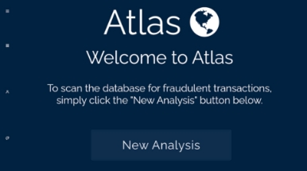
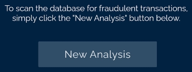
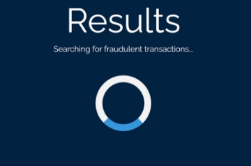
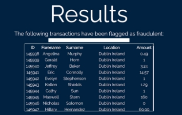
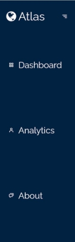
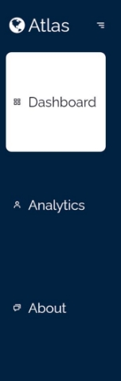
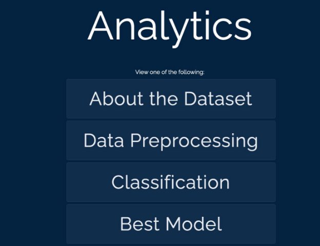

**User Manual**

**Name(s):**Jordan Ukawoko, Luke Whelan **Module Code:** CA326

**Project Title:** Atlas

**Supervisor**: Paul Clarke

Table of Content

[**Table of Content](#_page0_x72.00_y468.75) **0**

[**Introduction](#_page1_x72.00_y104.25) **2**

1. [Launch interface](#_page1_x72.00_y561.00) 3
1. [Dashboard](#_page2_x72.00_y75.75) 3
1. [Loading Page](#_page2_x72.00_y541.50) 4
1. [Results Page](#_page3_x72.00_y309.00) 5
1. [Navigation Bar](#_page3_x72.00_y622.50) 5
1. [Analytics Page](#_page5_x72.00_y75.75) 6

[**Conclusion](#_page6_x72.00_y468.75) **8**

Introduction

Welcome to the official Atlas user manual. The goal is to provide financial institutions with a strong credit card fraud detector with strong data visualisation features and for the user to have a smooth experience with our application. As the use of online transactions continues, so does the risk of fraudulent activities.

This user manual has been created to guide you through the features and functions of Atlas. You will learn how to set up the app, navigate through the different pages and to start a new analysis.

We understand the importance of simplicity, which is why we have designed this user manual to appeal to everyone, with many visual aspects included in this user manual.

We encourage you to read this user manual carefully, to get the most of our application. Thank you for choosing Atlas.

1. **Launch interface**

Atlas can be launched through a simple executable (.exe) file on Windows or an Apple Disk Image (.dmg) file on MacOS. The 

exe/dmg file will have a suitable globe icon as 

seen on the right. 

2. **Dashboard**

Once launched, the user is greeted by the application’s dashboard. The dashboard displays the app title, a welcome message, and an alternating text prompt, which prompts users to 

start an analysis, or view analytics relating to the analysis. 

When the user hovers over the ‘New Analysis’ button, it animates 

appropriately. This, combined with the alternating text, gives 

the app a ‘live’ feel, which satisfies an important heuristic; ensuring 

user control and freedom. 

3. **Loading Page**

After clicking on the ‘New Analysis’ button, the user is shown a loading screen while Atlas’s machine learning algorithms go to work, and generate the analysis results. This was added with a key heuristic in mind: visibility of the system status.

4. **Results Page**

Once the analysis is complete, the user is shown a results page. The user is informed that following transactions 

have been flagged as fraudulent by 

Atlas. The user is offered a search bar, to search for a specific transaction. Note that the search will 

match any field relating to the 

transaction; in other words, the ID, 

forename, surname, location or 

amount of a specific transaction. 

5. **Navigation Bar**

The navigation bar can be accessed at the top left of the application, regardless of what page the user is currently on. This was an important feature as it was vital in meeting a key design heuristic; ensuring consistency and standards throughout the app. The bar can be opened and closed as the user pleases, and the rest of the app’s interface will dynamically adjust.

Each navigation bar item is in the shape of a tile, and hovering over the navigation bar displays a suitable ‘select’ animation, indicating to the user that the highlighted tab is currently highlighted.

 

6. **Analytics Page**

The analytics page provides the user with an opportunity to visualise and understand the data used and generated by Atlas’s algorithms, as well as the reasoning behind the use of those algorithms. The analytics page contains buttons providing access to subcategories of analytics. The following pages are visible:

- About the dataset:  Provides background information re. the dataset used.
- Data preprocessing: Outlines how Atlas cleans the dataset before analysis.
- Classification: Details how various models classified our input data. I.e. declared them as fraudulent or non-fraudulent.
- Best Model: Highlights how and why we selected the best model.
- Training (Smote): Outlines how we trained the dataset using the SMOTE function.
- Training (Non-Smote): Outlines how we trained the dataset without the SMOTE function.
- Notebook: Contains Atlas’s notebook. The notebook contains all of the code used throughout the development of the models.
- Observations: Contrasts the performance of the models with and without SMOTE.
- Terminology: Explains some of the terminology used and how they were used with Atlas.

Conclusion

We hope, after reading our user manual, that you have a better understanding of our application. Again, thank you for choosing Atlas.
6
